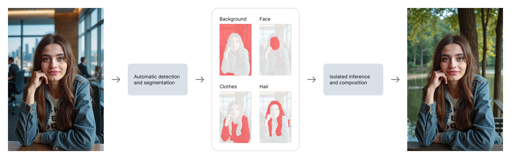

# AI-Powered Image Editing Workflows at BetterPic

## TL;DR

After rebuilding BetterPic's generation pipeline ([case study here]({{ '/case-study-betterpic-pipeline/' | relative_url }})), I built a suite of AI editing workflows that gave users precise control over their headshots — without degrading image quality. The key principle: **masking and segmentation isolate the edit area, so we never touch pixels that shouldn't change.**

---

## The Problem

Our new FLUX-based generation pipeline produced great headshots. But users aren't always satisfied on the first try — they want to change the background, try different clothes, fix a small detail, or get more variation. The obvious approach — regenerate the entire image — was wasteful, slow, and inconsistent. Each regeneration risks changing things the user already liked.

What we needed was **targeted editing**: change only what the user wants changed, and leave everything else untouched.

---

## The Core Approach: Mask-Based Editing

Every editing workflow we built follows the same principle:

```
Original image
    ↓
Segmentation / masking (isolate the edit region)
    ↓
AI inference (constrained to the masked area only)
    ↓
Composite (edited region blended back into original)
    ↓
Final image (unedited pixels are byte-identical to original)
```

This matters because images **don't degrade over multiple edits**. A user can change the background, then adjust the clothes, then fix a detail — and the face, skin, and hair remain pixel-perfect throughout. With full-image resampling, each edit would compound artifacts and drift from the original likeness.

<a href="img/masked_editing.png" target="_blank"></a>

---

## Consumer-Facing Workflows

### Background Replacement

User selects a background style from a curated set. We automatically segment the subject from the background, generate a new environment using a prompt template matched to the selected style, and composite the subject back in. The subject — face, hair, clothing — remains completely untouched.

<a href="img/bg_replace_01.png" target="_blank"></a>
<a href="img/bg_replace_02.png" target="_blank"></a>

### Clothes Replacement

Same mask-based approach applied to clothing. User picks a style, we load the corresponding prompt template, segment the clothing area while preserving face and skin, and generate new clothing that matches the body pose and lighting. Identity and facial features are fully preserved.

<!-- IMAGE: clothes_replacement.png -->
<!-- Caption: Clothes replacement — same person, different outfits -->

### Magic Fix

The most flexible tool. User draws a freehand mask directly in the browser interface and provides a text prompt describing what they want. We run inference constrained to that mask according to the prompt. This handles edge cases that no pre-built workflow can anticipate — fixing a stray hair, adjusting a collar, changing an accessory.

<!-- IMAGE: magic_fix.png -->
<!-- Caption: Magic Fix — user-drawn mask with custom prompt -->

### Magic Eraser

User masks an unwanted object — a background distraction, an artifact, an accessory they don't want. We remove it and fill the area seamlessly, matching the surrounding context. Similar to commercial "remove object" tools, but integrated into the headshot pipeline with full context awareness.

<!-- IMAGE: magic_eraser.png -->
<!-- Caption: Magic Eraser — object removal with seamless fill -->

### Expand

User specifies new image boundaries beyond the original frame — extending a tight headshot into a wider composition, or adding space above for a different crop. We generate content that seamlessly joins with the original image edges (outpainting), maintaining consistent lighting, style, and background.

<!-- IMAGE: expand.png -->
<!-- Caption: Expand — extending the frame with generated content -->

### Additional Adjustments

Simpler targeted workflows built on the same masking principle:

- **Skin smoothing** — subtle refinement applied only to skin regions, preserving texture in hair, clothing, and background
- **Eye color change** — precise eye segmentation with color-shifted regeneration

---

## B2B Custom Workflows

For business clients ordering headshots in bulk, we built streamlined workflows that combined generation and editing into a single automated pipeline:

- **Custom background** — headshot generation composited onto a client-provided background image, matching lighting and perspective
- **Custom clothing** — generation using a client-provided reference clothing image, applied consistently across all team members
- **Branded clothing** — generation with client-provided branding (logos, patterns) placed on the subject's clothing

These workflows turned what would be manual per-image editing into a fully automated batch process — a business client could submit an order for 50 team headshots with their office as the background and their branded polo shirts, and receive consistent results without manual intervention.

---

## What Ties It All Together

Every workflow in this suite — from simple skin smoothing to complex B2B batch processing — follows the same architectural pattern:

1. **Segment** — identify the region of interest using segmentation models
2. **Mask** — create a precise boundary between "edit this" and "don't touch this"
3. **Generate** — run inference constrained to the masked area
4. **Composite** — blend the result back, ensuring seamless transitions

This decomposition made each new workflow faster to build. Once the masking and compositing infrastructure was solid, adding a new editing capability was primarily about defining the right segmentation target and prompt template — not rebuilding the pipeline from scratch.

The design and photography background was critical here: knowing what makes an edit look natural — consistent lighting, proper color temperature, realistic shadows, natural fabric folds — informed every workflow's quality targets and evaluation criteria.

---

## Tech Stack

`FLUX.1-dev` `ComfyUI` `Segmentation` `Inpainting` `Outpainting` `Custom ComfyUI Nodes` `Python`
