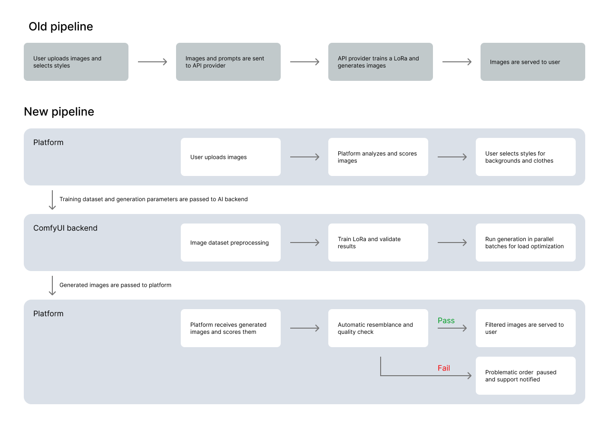

# From External API to In-House FLUX Pipeline: Rebuilding BetterPic's AI Stack

## TL;DR

In September 2024 I joined BetterPic as the founding AI engineer. The platform relied on an external API built on Stable Diffusion 1.5 for both LoRA training and image generation. Over the next few months, together with the CTO, I moved the entire AI pipeline in-house using ComfyUI and FLUX models.

| NPS | Orders | AI Cost |
|:---:|:---:|:---:|
| **+41%** | **5.6x** | **÷3** |

---

## The Starting Point

[BetterPic](https://www.betterpic.io) is an AI headshot generator ranked #1 for realism — users upload a few selfies and receive dozens of professional-quality headshots in various styles, backgrounds, and outfits. The platform serves individuals and teams, generating 60-100 images per order.

When I joined, BetterPic's AI headshot generation worked like this:

```
User uploads photos → External API trains LoRA (SD 1.5) → External API generates images → Delivered to user
```

The pipeline was a black box. We sent data to a third-party API, it came back as finished images. This had several problems:

- **Quality ceiling.** Stable Diffusion 1.5 was already outdated — faces lacked realism, skin textures were waxy, eyes were often lifeless, backgrounds looked artificial.
- **No control.** We couldn't tweak the generation pipeline, test new approaches, or fix specific quality issues. Every improvement request was a support ticket to the API provider.
- **Cost.** External API costs consumed a significant share of revenue per order, and margins didn't scale.
- **Speed of iteration.** Testing a new idea meant waiting for the API provider to implement it. We couldn't experiment.

[](img/before.png)
*Typical SD 1.5 API output — note the skin texture, eye detail, and background quality*

---

## The Decision

The initial plan was conservative: move the existing SD 1.5 pipeline in-house first, then upgrade to SDXL — the current tried-and-true architecture at the time. We started implementing this approach, but quickly realized we'd be investing serious engineering effort into a platform that was already showing its age.

So we changed course. Instead of migrating incrementally, we decided to skip two generations and jump straight to FLUX.1-dev — a completely different architecture with dramatically better output quality. This wasn't an incremental upgrade anymore. It was a full rebuild, and a bet that the quality leap would justify the extra complexity.

Why ComfyUI as the foundation:

- **Rapid prototyping** — visual node-based workflow design meant I could test ideas in minutes, not days
- **Input dataset manipulation** — powerful image preprocessing and augmentation before training
- **Full freedom of model choice** — swap any model, ControlNet, or post-processing step at will
- **Open-source architecture** — when existing nodes didn't do what I needed, I built custom ones

---

## What I Built

The new architecture:

```
User uploads photos
    ↓
Input preprocessing & face analysis (segmentation, detection)
    ↓
LoRA training on FLUX (per-user face model)
    ↓
ComfyUI generation pipeline
  ├── FLUX.1-dev base generation with user LoRA
  ├── Automatic detail refinement (eyes, skin, hair)
  ├── Configurable face inpainting
  ├── 4K upscaling with identity preservation
  └── Post-processing & quality checks
    ↓
Delivered to user (60-100 images per order)
```

### LoRA Training Pipeline

Built a custom LoRA training infrastructure for per-user face models on FLUX. Through extensive parameter testing and optimization, I developed a versatile and robust workflow that trains a usable LoRA from just 8 face images — keeping training fast and cheap on compute while maintaining high identity fidelity. Each customer's uploaded photos are preprocessed, captioned, and used to train a lightweight LoRA that captures their facial identity. The move from SD 1.5 to FLUX LoRAs was a generational leap in identity preservation.

**Similarity scores** (measured via AWS Rekognition):
- SD 1.5 API: averaging **98.50 — 99.50**
- FLUX in-house: consistently **99.99 — 100.00** (we had to increase measurement precision because the old scale topped out)

### Generation Pipeline

The ComfyUI-based inference pipeline chains multiple stages: base generation with FLUX.1-dev, automatic refinement of important details (eyes, skin, hair), configurable face inpainting for fine-tuned likeness control, and 4K upscaling with identity preservation. Each stage is modular — I can swap models, adjust parameters, or add new processing steps without rebuilding the whole pipeline.

### Custom Tooling

Where existing ComfyUI nodes didn't meet our needs, I developed custom nodes — for dataset preprocessing, quality evaluation, specialized post-processing, and integration with our backend systems.

### Architecture: Before & After

[](img/pipelines.png)
*Pipeline comparison*

---

## The Results

### Image Quality

[](img/after.png)
*Headshots generated by the new FLUX in-house pipeline*

The quality jump was immediately visible — skin texture, eye realism, hair detail, clothing folds, background depth. This wasn't a subtle improvement, it was a different tier of output entirely.

**Identity similarity (AWS Rekognition):**

| | SD 1.5 (External API) | FLUX (In-House) |
|---|---|---|
| Similarity score | 98.50 — 99.50 | 99.99 — 100.00 |

### Client Satisfaction (NPS)

Average NPS score by month:

| Month | NPS Score | Note |
|-------|-----------|------|
| Sep 2024 | **2.64** | Baseline — before any changes |
| Dec 2024 | **3.40** | Full pipeline rollout complete |
| Feb 2025 | **3.72** | Continued refinement |

**+41% NPS improvement** from baseline to Feb 2025, and it kept climbing with minor refinements after the initial migration.

### Business Growth

Monthly total orders:

| Month | Orders |
|-------|--------|
| Sep 2024 | 2,045 |
| Dec 2024 | 5,967 |
| Feb 2025 | 9,128 |
| May 2025 | 11,496 |

**5.6x order growth** from September 2024 to May 2025. Higher quality drove better reviews, better conversion, and more repeat customers.

### Cost Reduction

**Over 3x reduction in AI compute cost per order.**

Moving in-house cut the per-order AI cost to roughly a third of what the external API charged. At peak volume, this translated to significant monthly savings — while simultaneously delivering dramatically better quality. AI costs went from consuming a large share of per-order revenue to a manageable fraction.

---

## Key Takeaways

1. **Owning the pipeline is worth the investment.** The upfront effort of building in-house was paid back quickly through lower per-order costs and higher conversion from better quality.

2. **ComfyUI is a serious production tool.** Its visual workflow design enabled rapid iteration that would have taken 10x longer in pure code. The open-source ecosystem meant I could customize anything.

3. **Model generation matters more than model tuning.** Switching from SD 1.5 to FLUX was a bigger quality jump than any amount of prompt engineering or fine-tuning could achieve on the old model.

4. **Photography knowledge informs AI quality.** Knowing what makes a good headshot — lighting, composition, skin tones, catch lights in the eyes — meant I could identify and fix problems that a purely technical approach would miss.

---

## Tech Stack

`FLUX.1-dev` `ComfyUI` `LoRA` `Python` `PyTorch`
`AWS Rekognition` `Segmentation` `Face Detection` `Custom ComfyUI Nodes`
