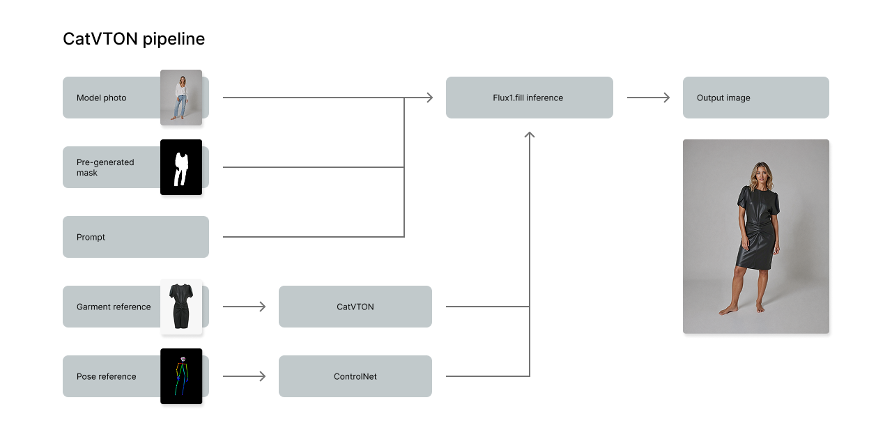
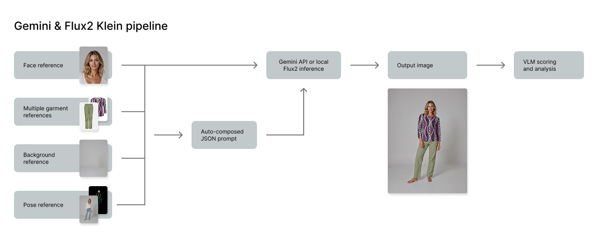

# AI Virtual Try-On for Fashion Photography

## Overview

After building BetterPic's headshot pipeline, we turned to a harder problem: virtual try-on for commercial fashion photography — letting brands generate product imagery without photo shoots. This was R&D that ran through most of 2025 into early 2026. The technology got to a point where it could meet commercial quality requirements. The project was ultimately shelved for business reasons, not technical ones.

---

## Approach 1: CatVTON + FLUX.1 Fill

[CatVTON](https://github.com/Zheng-Chong/CatVTON) is an open-source virtual try-on model that runs on top of **FLUX.1 Fill** — a dedicated inpainting model designed for masked partial editing. The approach is precise and technically demanding.

To perform a try-on, the model needs three things:
1. A **source image** — a photo of a model in a specific pose
2. A **reference garment image** — the clothing item to place on them
3. An **explicit inpaint mask** — an exact pixel-level map of the region to fill

When these three inputs are right, CatVTON produces genuinely impressive results. The garment drapes naturally, texture is preserved, and the composite looks convincing.

*How the CatVTON pipeline worked: pre-generated model poses with masks, paired with garment reference images*

*CatVTON results — solid garment transfer quality when inputs were well-prepared*

### The constraint this created

The model requires a **prepared source image** — not just any photo of a person, but one that matches the intended pose, framing, and body proportions, with a corresponding mask already generated for the clothing region. This means you can't compose freely at generation time. You have to pre-build a library of virtual model images in every pose you want to offer, generate precise segmentation masks for each, and store them all as paired assets before any try-on can happen.

This structure worked — but it was rigid. Setting up a new virtual model, adding a new pose, or adjusting for a different body type meant another round of pre-generation and masking. For each new client with specific requirements (a different model type, a different set of poses), operators had to go through the full setup before a single garment could be tried on. It was too slow.

---

## Approach 2: Reference-Based Prompting with Gemini and FLUX.2

When **Gemini 2.5 Flash Image** ("Nano Banana") released in mid-2025, it opened a different architecture entirely. Both Gemini and, later, **FLUX.2** were capable enough to accept multiple reference images alongside a structured prompt and compose them into a coherent result — without requiring pre-generated poses or explicit masks.

The inputs became:
- A **face reference** — who the virtual model should look like
- A **pose reference** — the body position and framing
- A **background reference** — the environment
- A **garment image** — the clothing item

*The reference-based approach: four separate inputs, composed through structured prompting*

The model handles the composition: placing the right face on the right body in the right pose, wearing the garment, in the right environment. No pre-generated assets required. Adding a new pose or background is as simple as adding a reference image to the library.

### The prompting challenge

"Give it the references and it figures it out" is only true if the prompt is precise. Early experiments produced inconsistent results — correct composition in some images, garment details missing in others, face drift across an order. Getting stable, repeatable output required a structured prompting approach.

We developed a two-layer system: auto-generated captions (using VL models to extract structured descriptions of each input — garment attributes, pose description, background characteristics) combined with a manual JSON constructor that let operators define and lock specific generation parameters. The final prompt assembled all of these into a coherent, structured instruction.

*Structured prompt assembly: captions from reference images + operator-defined parameters → generation prompt*

*Gemini 3 Pro Image vs FLUX.2 on the same inputs — by late 2025 the gap had narrowed significantly*

### Persistent challenges

Three problems remained across both model backends:

- **Fine detail preservation** — small brand-specific details (distinctive weave patterns, embroidery, logos) degraded during generation. Fixable with multi-stage refinement, but added pipeline complexity.
- **Virtual model identity** — maintaining consistent facial resemblance across an entire order (multiple poses, backgrounds, garments) required LoRA-based identity anchoring and careful prompt structure. Drift was always present to some degree.
- **Pose and lighting integration** — getting a generated figure to read as naturally lit against a specific background, especially at unusual angles, remained the most unpredictable part of the pipeline.

---

## The Platform Reality

The AI backend solved the generation problem. The harder problem was everything around it: ingesting brand product catalogues (hundreds of SKUs with inconsistent imagery and sparse metadata), structuring look compositions with client input, defining virtual photoshoot parameters, filtering and reviewing generated outputs at scale, and delivering final files to clients with their own format and naming standards.

Each of these was a real piece of work. As a team we built tooling to handle all of it — VL-based data ingestion, a look-composition interface, an operator parameter system, automated QC filtering, and a delivery layer.

The scope of the platform was the primary reason the project was shelved in early 2026. The AI quality was there. The investment required to harden and scale the surrounding platform — against a market that wasn't yet fully ready to replace traditional photography with AI — wasn't justified at that moment.

---

## What I'd Do Differently

**Map the platform scope before committing to the AI architecture.** Validating the AI first was the natural approach, but the platform requirements should have been scoped in parallel. The CatVTON-to-Gemini pivot made sense technically; the platform architecture needed the full-scope view much earlier.

**Design for backend swappability.** The shift from CatVTON to Gemini to FLUX.2 confirmed the pattern: closed commercial models lead open-source, open-source catches up. Building the generation layer with cleaner model-agnostic interfaces would have made each transition cheaper.

---

## Tech Stack

`CatVTON` `FLUX.1 Fill` `Gemini 2.5 Flash Image` `Gemini 3 Pro Image` `FLUX.2` `ComfyUI` `LoRA` `Vision-Language Models` `Segmentation` `Python`
